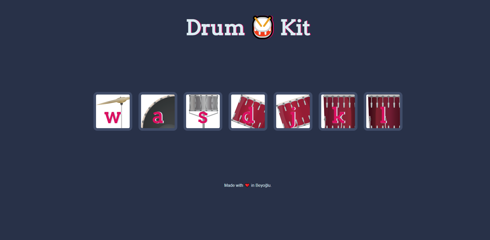

<!--
*** Thanks for checking out the Best-README-Template. If you have a suggestion
*** that would make this better, please fork the repo and create a pull request
*** or simply open an issue with the tag "enhancement".
*** Thanks again! Now go create something AMAZING! :D
-->

<!-- PROJECT SHIELDS -->
<!--
*** I'm using markdown "reference style" links for readability.
*** Reference links are enclosed in brackets [ ] instead of parentheses ( ).
*** See the bottom of this document for the declaration of the reference variables
*** for contributors-url, forks-url, etc. This is an optional, concise syntax you may use.
*** https://www.markdownguide.org/basic-syntax/#reference-style-links
-->

[![Contributors][contributors-shield]][contributors-url]
[![Forks][forks-shield]][forks-url]
[![Stargazers][stars-shield]][stars-url]
[![Issues][issues-shield]][issues-url]
[![MIT License][license-shield]][license-url]
[![LinkedIn][linkedin-shield]][linkedin-url]

<!-- TABLE OF CONTENTS -->

  
Table of Contents

  <ol>
    <li>
      <a href="#about-the-project">About The Project</a>
      <ul>
        <li><a href="#built-with">Built With</a></li>
      </ul>
    </li>
    <li><a href="#contact">Contact</a></li>
  </ol>

<!-- ABOUT THE PROJECT -->
## About The Project

#### JavaScript Used

*DOM Manipulation
*Control Structures
*HTML Audio API
*JavaScript CSS Manipulation
*addEventListener
#### Project Description/Summary
The point of this project is to have each key, when pressed, make a corresponding drum noise. It also uses CSS transitions and animations to make the project more interactive to the user. I completed this project earlier in my JavaScript learning phase. I found it quite confusing because I had never used the HTML audio API or the selection of DOM elements using the date-key attribute.

#### New Things Learned or Refreshed
This project involved the use a “data-key” attribute that I'd never seen before. The “data-key” attribute was then selected using the CSS selector[attribute] method. I found this interesting as this was the first time I had saw this done. I also learned how to associate an audio file with the audio API.

### Built With

This section should list any major frameworks that you built your project using. Leave any add-ons/plugins for the acknowledgements section. Here are a few examples.
* [Javascipt](https://www.javascript.com/)
* [HTML](https://html.com/)
* [CSS](https://css.com/)

<!-- CONTACT -->
## Contact

Furkan Çat - [@FurkanCat](https://twitter.com/FurkanCat) - furi544@gmail.com

Project Link: [https://github.com/your_username/repo_name](https://github.com/InsomniumFerum/Drum-Kit)

<!-- MARKDOWN LINKS & IMAGES -->
<!-- https://www.markdownguide.org/basic-syntax/#reference-style-links -->
[contributors-shield]: https://img.shields.io/github/contributors/InsomniumFerum/Best-README-Template.svg?style=for-the-badge
[contributors-url]: https://github.com/InsomniumFerum/Best-README-Template/graphs/contributors
[forks-shield]: https://img.shields.io/github/forks/InsomniumFerum/Best-README-Template.svg?style=for-the-badge
[forks-url]: https://github.com/InsomniumFerum/Best-README-Template/network/members
[stars-shield]: https://img.shields.io/github/stars/InsomniumFerum/Best-README-Template.svg?style=for-the-badge
[stars-url]: https://github.com/InsomniumFerum/Best-README-Template/stargazers
[issues-shield]: https://img.shields.io/github/issues/InsomniumFerum/Best-README-Template.svg?style=for-the-badge
[issues-url]: https://github.com/InsomniumFerum/Best-README-Template/issues
[license-shield]: https://img.shields.io/github/license/InsomniumFerum/Best-README-Template.svg?style=for-the-badge
[license-url]: https://github.com/InsomniumFerum/Best-README-Template/blob/master/LICENSE.txt
[linkedin-shield]: https://img.shields.io/badge/-LinkedIn-black.svg?style=for-the-badge&logo=linkedin&colorB=555
[linkedin-url]: https://www.linkedin.com/in/furkan-%C3%A7at-20174216/
[product-screenshot]: images/screenshot.png
